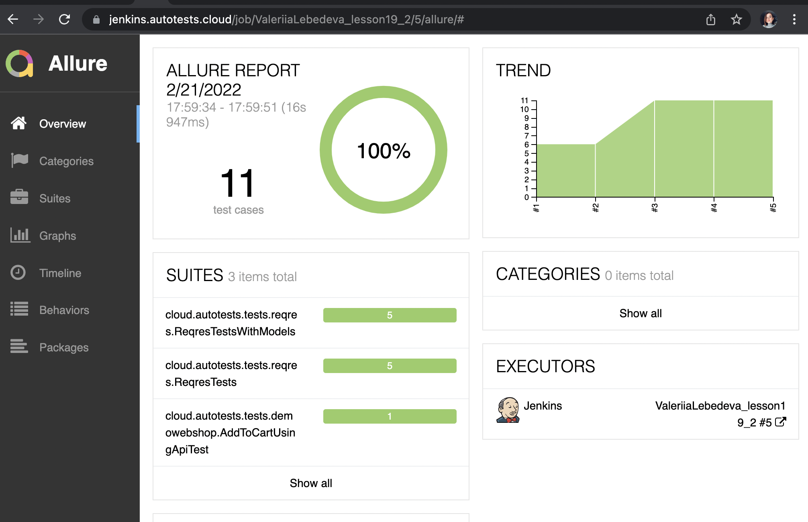
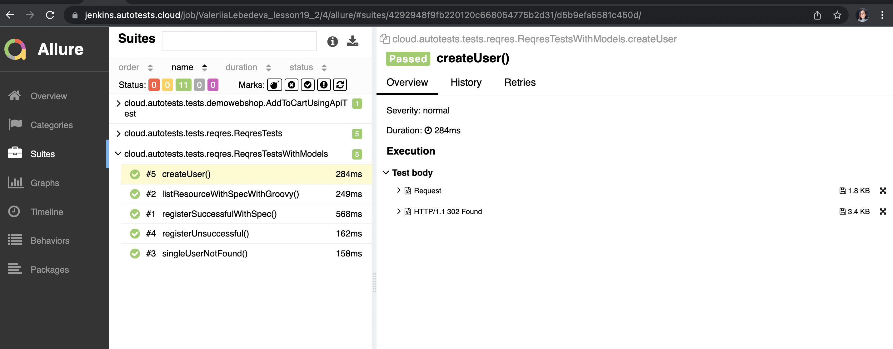
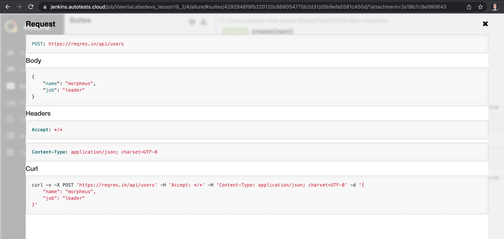
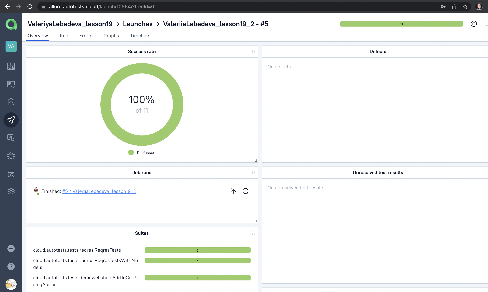
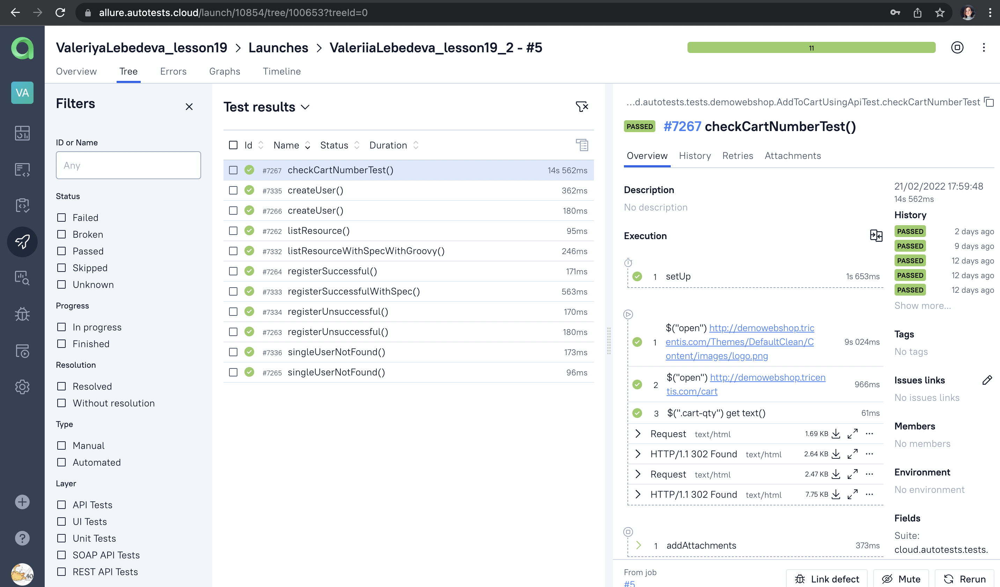

# API autotests

### GET and POST request tests were added for: 

#### 
### https://reqres.in/

### Adding item to cart using API and comparing it with UI cart item number test was added for:
### http://demowebshop.tricentis.com/


# USAGE examples

### Run tests from terminal:

```bash
gradle clean test
```

##### (Don't forget to add the configuration files:
##### - src/test/resources/config/app.properties
##### see congig file example here: src/test/resources/config/demowebshop/app_example.properties)


### Serve report:

```bash
allure serve build/allure-results
```


# Jenkins job
### https://jenkins.autotests.cloud/job/ValeriiaLebedeva_lesson19_2/

#### How to build project:
#### 1. Click on the 'Build now'

# Allure report examples

<p align="center">
  
</p>

<p align="center">
  
</p>

#### How Request looks in allure report:
<p align="center">
  
</p>

# Allure TestOps integration

<p align="center">
  
</p>

<p align="center">
  
</p>
